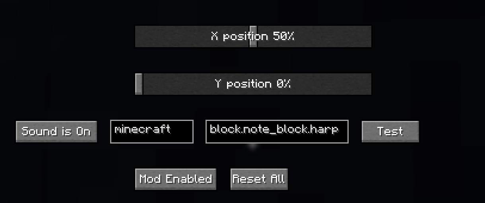

# What is this?
I'm not really sure, I found the [ISS Piss Tracker](https://bsky.app/profile/iss-piss-tracker.bsky.social) on Bluesky and decided that it needed a minecraft version.
This 1.21.8 Fabric mod renders a icon, you can modify where it is on screen

# Recommended mods
[ModMenu](https://modrinth.com/mod/modmenu) (allows editing the config in-game)
[Animatica](https://modrinth.com/mod/animatica) (Allows custom animated textures, the mod comes bundled with some extra textures)

# Configuration Options
- X Position (Relative Position on screen)
- Y Position (Relative Position on screen)
- Left-most text box (namespace of sound, mostly "minecraft" unless you are using sounds from a custom texture pack)
- Right-most text box (sound path, same as everything in /playsound after "minecraft:")
- Sound is On/Off (Toggles the notification sound)
- Test (Tests audio so you can make sure it will play the correct sound when it updates)
- Mod Enabled/Disabled (Whether entire mod is enabled or disabled, rendering & sound)
- Reset All (Resets all options)


# How to Build
Make sure you have JDK 21 installed, I recommend [Adoptium](https://adoptium.net/temurin/releases?version=21&os=any&arch=any)
```
git clone https://github.com/Chilllyy/ISSOSDFabric
(on linux) chmod +x gradlew
(windows command prompt) gradlew build
(linux & windows powershell) ./gradlew build
```